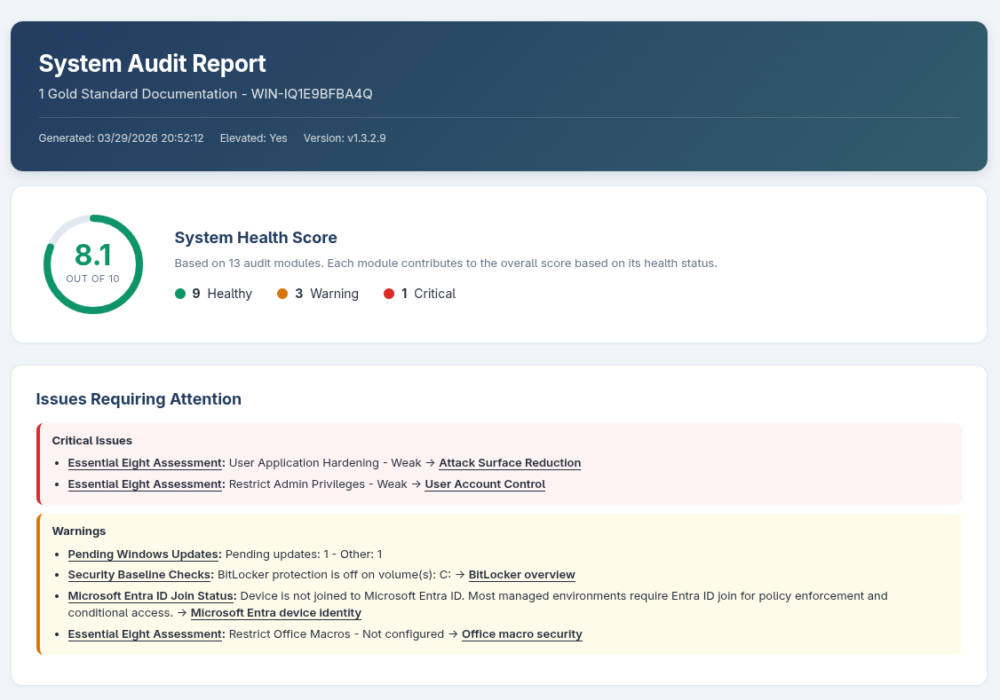

# Windows-Audit-Tool

A self-contained PowerShell script that audits a single Windows machine and produces a portable, single-file HTML report. No external modules required. Optional Hudu integration uploads the report directly to your documentation platform.

An optional WPF GUI wrapper (`WindowsAuditTool.exe`) provides a launch interface, live progress tracking, and an in-app report viewer.

---

# Author's Note
This tools was developed with AI as both a means to test AI capabilities and to also fix some holes in our teams auditability of customer endpoints. 



## Quick Start

**Option 1 — GUI (recommended for interactive use):**

Download `WindowsAuditTool.exe` and `Run-Audit.ps1` from the [latest release](https://github.com/Ripped-Kanga/Windows-Audit-Tool/releases/latest) and place them in the same folder. Double-click `WindowsAuditTool.exe` to launch.

The GUI detects whether `Run-Audit.ps1` is present alongside it. If the script is missing, a download button appears to fetch it from the latest GitHub release automatically.

**Option 2 — Script only (PowerShell prompt or right-click):**

Download the script:
```powershell
curl -o Run-Audit.ps1 https://github.com/Ripped-Kanga/Windows-Audit-Tool/releases/latest/download/Run-Audit.ps1
```

Run it:
```powershell
# Right-click Run-Audit.ps1 -> Run with PowerShell

# Or from an elevated PowerShell prompt:
powershell -ExecutionPolicy Bypass -File .\Run-Audit.ps1
```

**Option 3 — Unattended via RMM/MDM (Atera, Intune, etc.):**
```powershell
powershell -ExecutionPolicy Bypass -File .\Run-Audit.ps1 -Silent -CustomerName "Acme Corp"
```

**Option 4 — RMM deployment with `RMM-Deploy.ps1` (recommended for Atera, NinjaRMM, Datto):**

Upload `RMM-Deploy.ps1` once to your RMM platform. It automatically downloads and caches the latest `Run-Audit.ps1` from GitHub Releases on each run, so you never need to update the RMM script when a new version is released. Use `-RmmPlatform` to select your platform (default: `Atera`).

The deploy script is designed to be scheduled as a **daily RMM automation**. It includes a monthly guard check: the script scans the audit log (`C:\Program Files\Windows Audit Tool\Logs\AuditLog.txt`) for a successful completion entry timestamped in the current calendar month. If found, it exits immediately with code `3` and reports `Audit already completed this month` -- no GitHub calls, no audit run. This works correctly for both standard and Hudu deployments (Hudu deletes the local HTML report after upload, but the log entry is always written). On the first run each month, the audit proceeds normally. Pass `-ForceRun` to skip the guard and run unconditionally.

```powershell
# RMM script body -- no arguments needed for a basic run:
# (RMM-Deploy.ps1 injects -Silent automatically)

# Force a run even if an audit already completed this month:
-ForceRun

# With Hudu integration (creates a new dated asset each month):
-HuduReport -HuduAPIKey "your-api-key" -HuduBaseURL "https://your-instance.huducloud.com" -HuduCompanySlug "Hex String" -HuduAssetLayoutName "Audit Reports"

# With Hudu integration -- write into an existing asset named after the computer
# (finds the asset by name and updates it in place; creates it if it doesn't exist):
-HuduReport -HuduAPIKey "your-api-key" -HuduBaseURL "https://your-instance.huducloud.com" -HuduCompanySlug "Hex String" -HuduAssetLayoutName "Computers" -HuduEntryName $ComputerName -HtmlAttachmentName "$Date - $ComputerName"
```

The `-HuduEntryName` parameter controls the Hudu asset name. The `-HtmlAttachmentName` parameter controls the filename of the HTML report attachment uploaded to Hudu. Both support the following tokens, which are expanded on the endpoint at runtime (enter them literally in the RMM parameter field -- no quotes needed). Use `-KeepReports <n>` to control how many dated report archives are retained on the endpoint (default: `6`):

| Token | Expands to | Example |
|---|---|---|
| `$ComputerName` | Endpoint hostname | `DESKTOP-ABC123` |
| `$Date` | Run date (`yyyy-MM-dd`) | `2026-03-30` |
| `$CustomerName` | Value of `-CustomerName` if provided | `Acme Corp` |

When `-HuduEntryName` is used, the Hudu integration finds any existing asset with that name in the target layout and **updates it in place** rather than creating a new one. This lets you write audit reports directly into existing device records (e.g. assets synced from Atera). When `-HuduEntryName` is not set, the default name is `HOSTNAME - dd/MM/yyyy`, which is unique per day and always creates.

When `-HtmlAttachmentName` is used, the uploaded HTML attachment filename is set to the resolved value (`.html` is appended automatically if not present). When not set, the attachment uses the local report filename (e.g. `2026-03-30 - DESKTOP-ABC123-Audit.html`).

| Exit code | Meaning |
|---|---|
| `0` | Audit completed successfully |
| `1` | GitHub unreachable and no cached script available |
| `2` | Download failed and no cached script available |
| `3` | Audit already completed this month -- skipped (override with `-ForceRun`) |

Set the RMM script execution policy to `Bypass` and the timeout to **600 seconds**. See [`RMM-Deploy.ps1`](RMM-Deploy.ps1) for full setup notes.

**Option 5 — With Hudu integration (upload report directly to Hudu):**
```powershell
.\Run-Audit.ps1 -HuduReport `
    -HuduAPIKey "your-api-key" `
    -HuduBaseURL "https://your-instance.huducloud.com" `
    -HuduCompanySlug "Hex String" `
    -HuduAssetLayoutName "Audit Reports"
```

The `-Silent` switch suppresses the UAC elevation prompt and the "Press ENTER to exit" pause, allowing the process to exit cleanly in non-interactive contexts. In `-Silent` mode, script updates from GitHub are not applied automatically — pass an explicit update switch alongside `-Silent` to update during a deployment (e.g. `.\Run-Audit.ps1 -Silent -UpdateScript`). Use `-Silent` when deploying through endpoint management software that already runs the script in an elevated context (e.g. Atera agent as SYSTEM, Intune Win32 app with `runAsAccount = system`).

The script will request administrator privileges via UAC automatically in interactive mode. If elevation is declined it continues in limited mode, skipping admin-only checks and noting what was skipped in the report.

**Customer name:** In interactive mode the script prompts for a customer/business name after startup. Press ENTER to skip. In `-Silent` mode, pass `-CustomerName "Name"` to include it. When provided, the name appears in the report title, HTML heading, and output filename. When using `-HuduReport`, the customer name is automatically resolved from the Hudu company slug, so `-CustomerName` is not required.

**Outputs:**

Output paths are determined by deployment context, not elevation level.

**RMM / Silent mode** (when `-Silent` is passed, or the script runs from `C:\Program Files\...`):
| File | Path |
|---|---|
| HTML report | `C:\Program Files\Windows Audit Tool\Results\<DATE> - <ComputerName>-Audit.html` |
| HTML report (with customer name) | `C:\Program Files\Windows Audit Tool\Results\<DATE> - <CustomerName> - <ComputerName>-Audit.html` |
| Hudu preview (when `-HuduReport` used) | `C:\Program Files\Windows Audit Tool\Results\<ComputerName>-Audit-Hudu.html` |
| Operational log | `C:\Program Files\Windows Audit Tool\Logs\AuditLog.txt` |

**Interactive / GUI mode** (run from any other location):
| File | Path |
|---|---|
| HTML report | `<script-dir>\Windows Audit Tool\<DATE> - <ComputerName>-Audit.html` |
| HTML report (with customer name) | `<script-dir>\Windows Audit Tool\<DATE> - <CustomerName> - <ComputerName>-Audit.html` |
| Hudu preview (when `-HuduReport` used) | `<script-dir>\Windows Audit Tool\<ComputerName>-Audit-Hudu.html` |
| Operational log | `<script-dir>\Windows Audit Tool\AuditLog.txt` |

> The first few log entries written before the output directory is resolved always land in `C:\Windows\Temp\AuditLog.txt` (the bootstrap log). Once the deployment context is determined, logging continues at the final path above. The `Windows Audit Tool` output subdirectory is created automatically if it does not exist.

> When using `RMM-Deploy.ps1`, the script is cached at `C:\Program Files\Windows Audit Tool\Scripts\Run-Audit.ps1` and runs from that path, so RMM mode is activated automatically.

**Report archives:**

Before writing each new report, the script copies the existing report to a dated archive file in the same Results folder (e.g. `COMPUTERNAME-Audit-20260406-143022.html`). Only the most recent **6 archives** are kept — older ones are deleted automatically. Pass `-KeepReports <n>` to change this limit:

```powershell
.\Run-Audit.ps1 -KeepReports 12   # keep a full year of monthly archives
.\Run-Audit.ps1 -KeepReports 3    # keep the last quarter only
```

When Hudu integration is enabled, the most recent archive is used to generate a **"Changes Since Last Audit"** diff section in both the standalone HTML report and the Hudu RichText field, highlighting improvements and regressions between runs.

---

## GUI Wrapper

`WindowsAuditTool.exe` is a WPF application (.NET 8, Windows x64) that wraps `Run-Audit.ps1` with a graphical interface. It is distributed alongside the script on every GitHub release.

### Features

- **Launch view** — customer name input, elevation status indicator, script presence check, update banner
- **Live progress** — real-time progress bar and colour-coded log output as the audit runs
- **In-app report viewer** — renders the HTML report using the Microsoft WebView2 runtime; falls back to the default browser if WebView2 is not installed
- **Auto-update** — checks the GitHub Releases API on startup; one click downloads the new GUI exe and `Run-Audit.ps1`, then restarts
- **Script download** — if `Run-Audit.ps1` is missing, a button downloads it from the latest release

### Portable USB Stick Setup

Place the following in the same folder (e.g. a USB drive):

```
WindowsAuditTool.exe
Run-Audit.ps1
config.txt          (optional — pre-fills settings)
```

Reports are written to a `Windows Audit Tool\` subfolder next to the exe.

### config.txt

Create a `config.txt` file in the same folder as `WindowsAuditTool.exe` to pre-fill the customer name and Hudu settings. The file is loaded automatically on startup. Lines beginning with `#` are comments.

```ini
# Windows Audit Tool — GUI configuration
CustomerName=Acme Corp

# Hudu integration (optional)
HuduReport=true
HuduAPIKey=your-api-key
HuduBaseURL=https://your-instance.huducloud.com
HuduCompanySlug=0297b67dbba7
HuduAssetLayoutName=Audit Reports
HuduEntryName=$ComputerName
```

All keys are optional. Any key not present in `config.txt` uses its default (empty / disabled).

### How the GUI Runs the Script

The GUI launches `Run-Audit.ps1` as a child `powershell.exe` process with `-Silent` and passes through the customer name and any Hudu parameters. Console output from the script is captured and displayed in the progress log. When the script finishes, the HTML report path is parsed from the output and loaded into the WebView2 panel.

### Requirements (GUI)

- Windows 10 x64 or later
- No separate .NET runtime installation required (the exe is self-contained)
- Microsoft WebView2 Runtime for in-app report viewing (most Windows 10/11 machines already have it via Edge; the GUI falls back to the default browser if absent)

---

## Self-Update

The script checks the [GitHub Releases](https://github.com/Ripped-Kanga/Windows-Audit-Tool/releases) API on every interactive run to detect newer versions.

**Interactive mode (default):** If an update is found, the script pauses and recommends updating before continuing:

```
    Update available: 1.1.0 -> v1.2.0
    It is recommended you update before continuing.
    Restart the script with one of the following switches:
      .\Run-Audit.ps1 -UpdateAll       # update script + GUI exe
      .\Run-Audit.ps1 -UpdateScript    # update script only

    Press ENTER to continue with the current version...
```

| Switch | What it downloads |
|---|---|
| `-UpdateAll` | Both `Run-Audit.ps1` and `WindowsAuditTool.exe` from the release assets |
| `-UpdateScript` | `Run-Audit.ps1` only |

After updating the `.ps1`, the script automatically re-launches the new version and runs the audit.

**Silent mode (`-Silent`):** The update check is skipped entirely. No GitHub API call is made and no update is applied. To update during a Silent deployment, pass an explicit update switch alongside `-Silent` (e.g. `.\Run-Audit.ps1 -Silent -UpdateScript` or `.\Run-Audit.ps1 -Silent -UpdateAll`). The banner is also suppressed in Silent mode — no console output is rendered until the audit sections begin.

**No internet / GitHub unreachable:** The update check silently fails and the audit proceeds with the current version. Update failures never block the audit.

> **Note for releases:** Both `Run-Audit.ps1` and `WindowsAuditTool.exe` are attached as assets to each GitHub Release. The updater looks for files ending in `.ps1` and the GUI exe by name in the release assets.

---

## Hudu Integration

The script can upload audit reports directly to [Hudu](https://www.huducloud.com/), writing into an existing asset entry or creating a new one. Enable this with the `-HuduReport` switch and the required parameters:

| Parameter | Description |
|---|---|
| `-HuduReport` | Enable Hudu integration |
| `-HuduAPIKey` | Your Hudu API key (generate from Admin > API Keys in Hudu) |
| `-HuduBaseURL` | Your Hudu instance URL (e.g. `https://your-instance.huducloud.com`) |
| `-HuduCompanySlug` | The hex slug from your Hudu company URL (e.g. `0297b67dbba7` from `https://instance.huducloud.com/c/0297b67dbba7`) |
| `-HuduAssetLayoutName` | The name of the asset layout to write into (e.g. `Audit Reports`, `Atera Devices`) |
| `-HuduEntryName` | *(Optional)* The name of the individual entry within the layout. If an entry with this name already exists it is updated in place; otherwise a new entry is created. When omitted, the default name is `HOSTNAME - dd/MM/yyyy` (always creates a new dated entry). |
| `-KeepReports` | *(Optional)* Number of dated HTML report archives to retain on disk. Default: `6`. Older archives beyond this limit are deleted after each run. |

**Example — create a new dated entry each run:**
```powershell
.\Run-Audit.ps1 -HuduReport `
    -HuduAPIKey "your-api-key" `
    -HuduBaseURL "https://your-instance.huducloud.com" `
    -HuduCompanySlug "Hex String" `
    -HuduAssetLayoutName "Audit Reports"
```

**Example — update an existing device record by name:**
```powershell
.\Run-Audit.ps1 -HuduReport `
    -HuduAPIKey "your-api-key" `
    -HuduBaseURL "https://your-instance.huducloud.com" `
    -HuduCompanySlug "Hex String" `
    -HuduAssetLayoutName "Atera Devices" `
    -HuduEntryName "$env:COMPUTERNAME"
```

**How it works:**
1. The script resolves the company name from the slug via the Hudu API and uses it as the customer name in the report (no need to pass `-CustomerName` separately)
2. All audit HTML is transformed in real-time into Hudu-compatible inline-styled HTML (Hudu's ActionText editor strips `<style>` blocks)
3. If `-HuduEntryName` is set, the script searches the target layout for an existing entry with that name and updates it (PUT); if none is found, or if `-HuduEntryName` is omitted, a new entry is created (POST)
4. The full standalone HTML report is attached to the entry as a downloadable file
5. A local Hudu preview file is also saved for reference; both local files are removed after a successful upload and attachment
6. If a previous report archive exists on disk, the script compares key metrics between runs and injects a **"Changes Since Last Audit"** section into both the Hudu entry and the standalone HTML, highlighting health score changes, new/resolved issues, and software changes

**Asset layout requirements:** The target asset layout must have at least one RichText field. The script automatically detects and uses the first RichText field in the layout.

**Graceful degradation:** If any Hudu parameter is missing, the API is unreachable, or the company slug cannot be resolved, the script logs the issue and continues the audit normally. Hudu failures never block the local report.

**RMM/MDM deployment with Hudu:**
```powershell
.\Run-Audit.ps1 -Silent -HuduReport `
    -HuduAPIKey "your-api-key" `
    -HuduBaseURL "https://your-instance.huducloud.com" `
    -HuduCompanySlug "Hex String" `
    -HuduAssetLayoutName "Atera Devices" `
    -HuduEntryName "$env:COMPUTERNAME"
```

---

## What It Collects

The audit runs 13 sequential sections. Each section fails independently — a problem in one area never stops the rest.

### 1. System Information
Operating system, edition, build number, install date, uptime, CPU model and core count, total RAM, and attached disk drives with size and model.

### 2. Installed Software
Merged inventory from all available sources: HKLM and HKCU uninstall registry keys (both 64-bit and WOW6432Node), per-user registry hives including offline NTUSER.DAT files, AppX/Store packages, and Winget. Automatically deduplicates across sources, merging scope and origin metadata. Displayed as two separate tables — **Microsoft software** and **Third-Party software** — each with an independent interactive search/filter bar.

### 3. Patches / Hotfixes
All installed Windows hotfixes and cumulative updates via `Get-HotFix`, sorted by install date.

### 4. Pending Windows Updates
Queries the Windows Update Agent (WUA) COM API directly — no PSWindowsUpdate module required. Reports update title, KB number, size, and severity for all pending updates.

### 5. Network Adapters
All physical and virtual adapters with connection status, MAC address, link speed, media type, driver version, driver date, and manufacturer. For each connected adapter: IPv4 address with prefix length, IPv6 addresses (global and link-local), default gateways, DNS servers, DHCP status, DHCP server address, lease obtained/expires dates, and network profile (Public/Private/Domain).

### 6. SMB Shares
All network shares with path, description, and an exposure classification: system shares (IPC$, ADMIN$), administrative drive shares (C$), and custom shares that expose data to the network.

### 7. Printers
Installed printers with driver name, port, and whether they are shared.

### 8. Security Baseline *(requires administrator)*
| Check | Details |
|---|---|
| BitLocker | Volume protection status and lock state per drive |
| TPM | Presence, version, and ready state |
| Secure Boot | UEFI Secure Boot enabled/disabled |
| Windows Firewall | Domain, Private, and Public profile state |
| Windows Defender | Real-time protection, signature version, last scan times |
| Anti-Virus Products | All SecurityCenter2-registered AV products with engine and signature status; deduplicated by product name so multi-component suites (e.g. Sophos Intercept X) appear as a single entry |
| Local Administrators | All members of the local Administrators group |

### 9. User Accounts
Local user accounts (enabled/disabled status, password requirements, last logon time, password age, description — accounts without a required password are flagged) and a separate sub-section for **Entra ID accounts** that have signed into this machine, pulled from the ProfileList registry.

### 10. Startup Programs
Programs configured to run at startup from registry Run/RunOnce keys (HKLM and HKCU) and WMI `Win32_StartupCommand`, with automatic deduplication across sources.

### 11. Event Log Health
Checks the five core Windows event logs (Application, Security, System, Setup, PowerShell) for enabled status, current size vs. maximum capacity, record count, and retention mode. Warns when logs are near full or disabled.

### 12. Microsoft Entra ID Join Status
Parses `dsregcmd /status` output to report Entra ID (formerly Azure AD) join state, tenant name, and tenant ID.

### 13. Essential Eight Assessment
Read-only checks mapped to all eight ASD Essential Eight mitigation strategies, with a **summary scorecard** at the top showing pass/warn/fail status for each control at a glance:

| Strategy | Checks performed |
|---|---|
| Application Control | AppLocker enforcement mode (Enforce vs Audit-only vs Not configured); WDAC SIPolicy.p7b file presence and CI registry key; PowerShell machine-level execution policy |
| Patch Applications | Days since most recent hotfix; Windows Update automatic update policy; WUfB deferral settings; installed Edge and Chrome version from registry (flags versions below a staleness threshold) |
| Restrict Office Macros | `VbaWarnings` per app (Word, Excel, PowerPoint, Outlook, Access) via Group Policy then user setting; Excel XL4 macro block (`Excel4MacroSheets`); internet-sourced macro block (`BlockContentExecutionFromInternet`) per app |
| User Application Hardening | Controlled Folder Access; Network Protection; ASR rules with per-rule mode (Block/Audit/Disabled) and named rule descriptions in a collapsible detail table; SmartScreen policy state; Windows Script Host disabled check; PowerShell v2 status; Internet Explorer presence |
| Restrict Admin Privileges | UAC `EnableLUA`; `ConsentPromptBehaviorAdmin` level; `FilterAdministratorToken` (built-in admin RID-500 restriction); LAPS detection (Windows LAPS registry key, legacy AdmPwd CSE, and legacy policy key); local administrator count |
| Patch Operating Systems | OS build and feature version; days since last patch; Windows Update service state; Microsoft Update registration (non-OS Microsoft products included) |
| Multi-Factor Authentication | Windows Hello for Business policy (Enabled/Disabled/Not configured); NGC store enrollment check to distinguish policy-set vs actually enrolled; dsregcmd `NgcSet` correlation for Entra-joined machines; smartcard reader detection; cached domain credential count |
| Regular Backups | VSS shadow copy count with newest snapshot age in days (flags stale or absent snapshots); VSS service status; third-party backup agent detection from installed software (Veeam, Acronis, Datto, Backblaze, and 20+ others); File History registry flag; OneDrive process detection; Windows Backup scheduled tasks |

---

## Output Format

The report is a **single self-contained HTML file** with embedded CSS and minimal inline JavaScript. No external stylesheets, no external scripts, no internet access needed to view it. It opens correctly in any browser and can be attached to emails, uploaded to ticketing systems, or archived as-is.

Report features:
- **Professional header** with customer name branding and gradient accent banner
- **Numbered table of contents** with clickable navigation
- **Numbered section headings** that stick when scrolling for easy orientation
- **Color-coded severity** — green/amber/red callout bars, row highlighting, and badges throughout
- **Interactive search** on the installed software table for quick filtering
- **Collapsible detail sections** for long tables (auto-expanded when printing)
- **Print-ready** — `Ctrl+P` produces a clean PDF with all sections expanded and UI elements hidden

---

## Requirements

- Windows 10 or later
- PowerShell 5.1 or later
- Local administrator access recommended (required for security baseline and Essential Eight checks; script continues without it)
- No external PowerShell modules required
- Internet access required for: self-update checks against the GitHub Releases API; Hudu integration (optional)

---

## Intended Use Cases

- ICT audits for small and medium businesses
- Pre-migration environment discovery and documentation
- Baseline snapshots for inherited or unmanaged systems
- Essential Eight compliance evidence gathering
- Client-facing technical reports with minimal manual effort

---

## Design Principles

**Partial data beats no data.** Every section is independent. A failed WMI query, blocked command, or missing privilege produces a visible warning in the report rather than crashing the audit.

**Minimal configuration.** No configuration files or external modules required for basic use. The optional `config.txt` pre-fills GUI settings. Hudu integration requires API credentials passed as parameters.

**Self-contained output.** The HTML report is a single file. No viewer software, no server, no dependencies.

**No permanent changes.** The script is read-only. It does not install software, modify configuration, or alter any system state. Execution policy is relaxed for the current process only and reverts when the script exits.

---

## Limitations

- Audits a single machine per run
- Results are a point-in-time snapshot only
- Admin-only sections are skipped gracefully when elevation is unavailable
- Essential Eight checks detect configuration signals only and do not constitute a formal E8 assessment
- MFA checks reflect endpoint-observable signals; identity provider enforcement cannot be verified from the local machine

---

## License

MIT 2025
